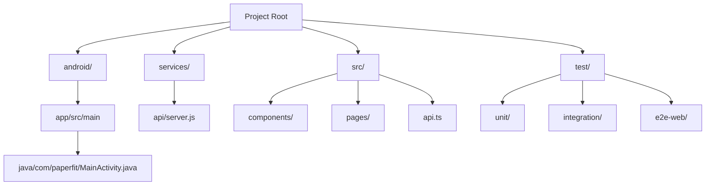

# PaperFit

PaperFit is a minimal "newspaper-styled" workout tracking application. It follows a **Hybrid Architecture**, combining the flexibility of a React web application with the system integration of a native Android shell.

## Architecture Overview

PaperFit's architecture is composed of three distinct layers:

### 1. The Native Shell (Android)
The entry point is a native Android application (`android/`) that hosts a single `WebView`.
-   **WebView Wrapper**: `MainActivity.java` configures a full-screen Chrome WebView to load the React application.
-   **JavaScript Bridge**: A custom `WebAppInterface` class exposes native functionality (like Toasts and Permission Requests) to the web context via the `window.Android` global object. This allows the web app to feel "native".
-   **Configuration**: Handles internet permissions and hardware back button navigation within the web history.

### 2. The Frontend (React PWA)
The user interface (`src/`) is a Single Page Application (SPA) built with React and Vite.
-   **Routing**: `react-router-dom` manages navigation between the Dashboard (`HomePage`), Workout Plan (`PlanPage`), Analytics (`StatsPage`), and Settings (`ProfilePage`).
-   **Design System**: A custom "Newspaper" theme (`index.css`) uses CSS variables for typography (Georgia/Serif) and spacing.
-   **Data Visualization**: `StatsPage` uses **Apache ECharts** (`echarts-for-react`) to render interactive progress charts. Theme tokens are shared between CSS and JS via `useTheme.ts` to ensure charts match the UI.
-   **Motion & UX**: **Framer Motion** powers page transitions (`MotionPage`) and scroll-triggered reveals (`StatCard`). It respects system "Reduced Motion" settings for accessibility.
-   **State & Logic**: The `SessionPlayer` manages complex workout state (timers, set logging, exercise progression) locally before syncing to the backend.

### 3. The Backend (Node.js & SQLite)
A lightweight REST API (`services/api/`) manages data persistence.
-   **Express Server**: Handles HTTP requests for workouts, sessions, and statistics.
-   **SQLite Database**: Stores relational data (Users, Exercises, Workouts, Sessions, Sets) in a local file (`paperfit.db`).
-   **Seeding**: On startup, the server automatically populates the database with default exercises and workout templates if empty.

## File Structure



## Testing Strategy

The project uses a tiered testing approach:
1.  **Unit Tests (Vitest)**: Fast tests for UI components (`HomePage.test.tsx`) using `jsdom` and React Testing Library. Mocking is used for browser APIs like `IntersectionObserver`.
2.  **Integration Tests (Vitest + Supertest)**: Tests for the backend API (`api.test.ts`) running against the real SQLite database to verify endpoints.
3.  **E2E Web Tests (Playwright)**: Browser-based tests (`bridge.spec.js`) that simulate the Android environment by injecting a mock `window.Android` object, verifying the JS Bridge works as expected.

## Setup and Running

1.  **Install Dependencies**:
    ```bash
    npm install
    ```

2.  **Start the Stack**:
    You can run the API and Frontend separately, or use the test scripts.
    ```bash
    # Start Backend
    npm run start:api

    # Start Frontend
    npm run dev
    ```

3.  **Run Tests**:
    ```bash
    # Unit Tests
    npm run test:unit

    # Integration Tests
    npm run test:integration

    # E2E Tests (ensure local dev server is running on port 3000)
    npm run test:e2e:web
    ```

4.  **Android Development**:
    Open the `android` folder in Android Studio. Ensure the `MainActivity.java` URL points to `http://10.0.2.2:3000` (Android emulator localhost alias) to connect to your local dev server.
