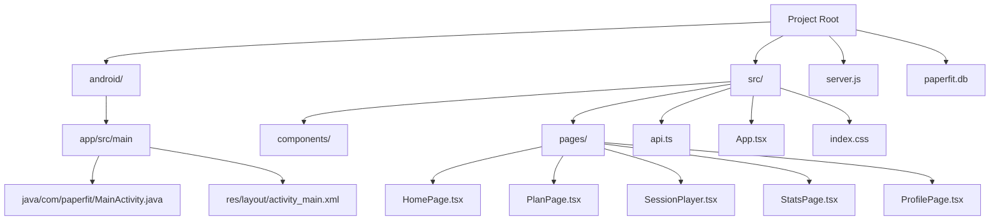

# PaperFit

PaperFit is a minimal "newspaper-styled" workout tracking application. It is designed as a hybrid mobile application where an Android native shell hosts a responsive web application built with React. The backend is powered by Node.js and SQLite.

## File Structure



## File Descriptions

### Root Directory
- **`server.js`**: The backend server entry point. It runs an Express application that manages the SQLite database (`paperfit.db`). It handles API requests for fetching workouts, starting sessions, logging sets, and retrieving statistics. It also handles database initialization and seeding.
- **`paperfit.db`**: The SQLite database file storing user data, exercises, workouts, and logs.
- **`package.json`**: Manages project dependencies and scripts.

### Source Code (`src/`)
- **`api.ts`**: Contains helper functions for making HTTP requests to the backend API (`fetchWorkouts`, `logSet`, etc.). It abstracts the `fetch` calls.
- **`App.tsx`**: The main React component that sets up the routing configuration using `react-router-dom`. It defines which component renders for each URL path.
- **`index.css`**: Defines the global styles for the application, implementing the "Minimal Newspaper" design system (typography, spacing, borders).
- **`components/Layout.tsx`**: A wrapper component that renders the persistent bottom navigation bar and the current page content.

### Pages (`src/pages/`)
- **`HomePage.tsx`**: The dashboard screen. It displays the user's streak, summary stats, and a "Recommended Workout" card to quickly start training.
- **`PlanPage.tsx`**: Displays the library of available workout templates. Users can browse and select a workout to start.
- **`SessionPlayer.tsx`**: The core workout interface. It runs as a standalone full-screen page. It guides the user through exercises, tracks sets/reps/weight, manages rest timers, and handles workout completion.
- **`StatsPage.tsx`**: Displays user progress, including total sessions completed and a history of recent sets.
- **`ProfilePage.tsx`**: Manages user preferences (like dark mode or units) and provides buttons to test the Android Native Bridge integration.

### Android Native (`android/`)
- **`MainActivity.java`**: The main Java activity for the Android app. It sets up a `WebView` to load the web application. It also establishes a JavaScript Bridge (`window.Android`) that allows the web app to trigger native functionality like Toasts or Permission requests.
- **`AndroidManifest.xml`**: Configuration file that declares the app's permissions (Internet) and activities.
- **`activity_main.xml`**: The XML layout file containing the `WebView` element.

## Setup and Running

1.  **Install Dependencies**:
    ```bash
    npm install
    ```

2.  **Start the Backend**:
    ```bash
    node server.js
    ```
    The API runs on `http://localhost:3001`.

3.  **Start the Frontend**:
    ```bash
    npm run dev
    ```
    The web app runs on `http://localhost:3000` (or similar).

4.  **Android Development**:
    Open the `android` folder in Android Studio to build and run the native wrapper. Ensure the `MainActivity.java` URL points to your local machine's IP (e.g., `http://10.0.2.2:3000` for the emulator).
